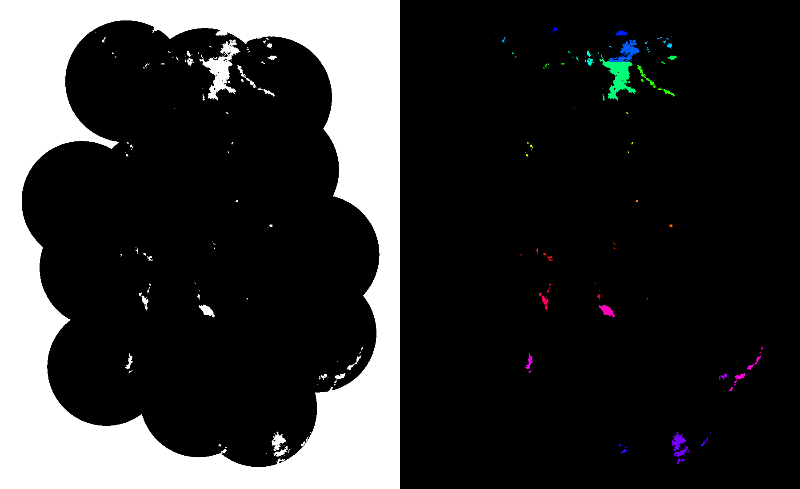

* Wolken werden mit sequentiellem labeling markiert und anhand ihrer größer gefärbt
* Wolken werden in zwei aufeinanderfolgenden Bildern gefunden
* Probleme, wenn Wolken auseinanderbrechen

#### Optischer Fuss 
    
    -> probleme wenn Wolken Plötzlich verschwinden, weil sie abgeregnet haben.
    -> Mögliche Lösung: stärke der Wolke beachten

* Schwerpunkte der Wolken ändern sich kaum (Außer Wolken brechen auseinander)

